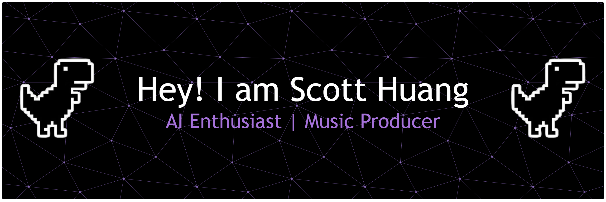

<div align="center">

<!-- Custom Header Banner -->


<!-- Header Wave -->


<!-- Typing Animation -->
<a href="https://github.com/averatec0773">
  
</a>

<br/>

<!-- Visitor Badge + Profile Views -->

&nbsp;
<a href="https://github.com/averatec0773?tab=followers">
  
</a>

</div>

---

## About Me

```python
scott = {
    "name":       "Scott Huang",
    "location":   "Boston, MA",
    # "education":  [
    #     "B.Eng. Artificial Intelligence  — Xiamen University",
    #     "M.S.  Machine Learning          — Northeastern University",
    # ],
    "roles":      ["AI Enthusiast", "LLM Agent Builder", "Music Producer"],
    "focus":      ["LLM Agents", "Reinforcement Learning", "Deep Learning", "AI Systems"],
    "side_quest": "Exploring AI creation & Producing beats",
    "motto":      "Always learning, always creating.",
}
```

> I explore and build **intelligent AI systems** with a focus on LLM agents and real-world applications.
> Outside of research, I produce **Hip-Hop instrumentals** and push the boundaries of AI + music creativity.

---

## Tech Stack

<div align="center">

**Languages & Core**


**ML / DL Frameworks**


**AI Tools**


**Tools & Platforms**


**Music Producing**


</div>

---

## GitHub Stats

<div align="center">


&nbsp;


<br/>


</div>

---

## Featured Projects

<div align="center">

<!-- TODO: Add featured project cards here -->

</div>

---

## Music — AYETEK Beats

> I produce **Hip-Hop instrumentals** under the alias **AYETEK**. My sound blends dark melodies, hard-knocking 808s, and cinematic textures.
> Exploring how **AI can assist in music creation** is a growing passion of mine.

<div align="center">

| Track | Mood | BPM |
|-------|------|-----|
| 🎵 Browse latest on BeatStars → | | |

[](https://www.beatstars.com/ayetek0773)
[](https://music.163.com/#/artist?id=50982361)

</div>

---

## Connect With Me

<div align="center">

[](https://www.linkedin.com/in/yiyangh/)
[](https://github.com/averatec0773)
[](https://www.beatstars.com/ayetek0773)
[](https://music.163.com/#/artist?id=50982361)

</div>

---

<div align="center">

<!-- TODO: Contribution graph — uncomment below to re-enable when ready -->
<!--  -->

<!-- Footer Wave -->


*"Code the future. Produce the soundtrack."*

</div>
